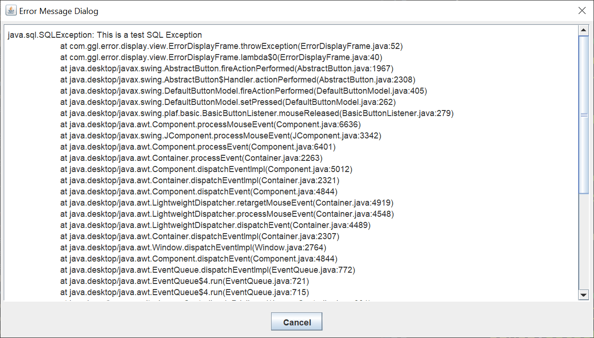

# Error Display Dialog

A recent Stack Overflow question prompted me to create an example GUI to display a Java `Exception`.  I thought it might be useful to create an error display dialog to display a Java `Exception` in a Swing GUI.

So i created the following test GUI.

Left-clicking the button brings up the error display dialog.

To use the error display dialog, copy the `ErrorDisplayDialog` class into your project.  The class requires no other classes.

Whenever you create a try-catch block in your Swing GUI, instead of coding this:

			try {
				// Code that could throw an Exception
			} catch (SQLException e) {
				e.printStackTrace();
			}	

You code this:

			try {
				// Code that could throw an Exception
			} catch (SQLException e) {
				new ErrorDisplayDialog(frame, "Error Message Dialog", e);
			}	

I used an `SQLException` in my testing, but the display dialog should work with any `Exception`.
